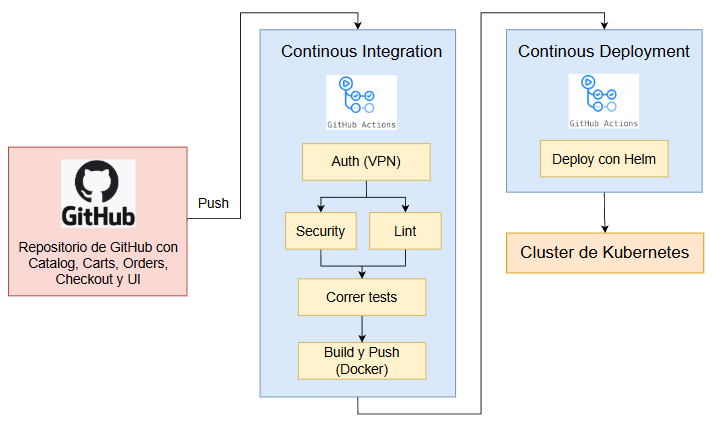

# Continuous Integration / Continuous Deployment

Este documento detalla la configuración y el funcionamiento del pipeline de Integración Continua / Despliegue Continuo (CI/CD) implementado para los microservicios de la aplicación The Store, utilizando GitHub Actions y Helm.

El objetivo fue automatizar completamente el ciclo de vida del software para cada microservicio. Cualquier cambio activa un workflow que se encarga de:

- Validar y Construir el código.
- Empaquetar el servicio en una imagen Docker.
- Desplegar la nueva versión de forma segura y consistente en el cluster de Kubernetes (K8s).

## Objetivos

- Automatizar el proceso de **build**, **test**, **push** y **deploy** de los microservicios.  
- Evitar la exposición de credenciales mediante el uso de **GitHub Secrets**.  
- Integrar de forma nativa con el repositorio alojado en GitHub.  
- Estandarizar la entrega continua usando **Helm** para los despliegues en Kubernetes.

## Arquitectura de *The Store*

La aplicación se compone de **cinco microservicios** desarrollados en distintos lenguajes de programación.  
Cada uno posee su propia base de datos y puede escalar de manera independiente.

Características principales:
- **Microservicios independientes**
- **Escalabilidad horizontal**
- **Bases de datos desacopladas**
- **Integración vía API Gateway**

## Configuración de Secrets en GitHub

Los Runners de GitHub Actions necesitan credenciales seguras para interactuar con los sistemas externos. Estas credenciales deben configurarse como Secrets en el repositorio de GitHub (Settings -> Secrets -> Actions).
- `AWS_ACCESS_KEY_ID`
- `AWS_SECRET_ACCESS_KEY`
- `DOCKERHUB_TOKEN`
- `DOCKERHUB_USERNAME`
- `KUBECONFIG`
- `NVD_API_KEY`
- `OVPN_CLIENT_KEY`
- `OVPN_CONFIG`
- `OVPN_TLS_AUTH_KEY`

## Estructura y Componentes del Pipeline

El pipeline se define en archivos YAML dentro del directorio `.github/workflows/`.

### Directorios Clave 

- `.github/workflows/`: Contiene los archivos YAML de los Workflows de CI/CD
- `.charts/`: Contiene los Helm Charts (paquetes de K8s) para cada microservicio.
- `<servicio>/Dockerfile`: El archivo para construir la imagen Docker específica del servicio.

### Fases del Workflow 

A continuación se muestra el pipeline implementado.

#### Flujo General

1. **Evento (Trigger):**  
   El pipeline se inicia automáticamente cuando se realiza un `push` o `pull request` sobre las ramas `main` o `development`.

2. **Workflow (.yml):**  
   GitHub detecta el evento y ejecuta el archivo de configuración YAML correspondiente.

3. **Runner:**  
   Se lanza una máquina virtual Ubuntu (runner hospedado por GitHub) donde se ejecutan los *jobs* definidos.

4. **Jobs y Steps:**  
   - **Build:** Compilación del servicio y creación de la imagen Docker.  
   - **Test:** Ejecución de los tests del microservicio.  
   - **Login:** Autenticación en Docker Hub usando secrets.  
   - **Push:** Publicación de la imagen en Docker Hub.  
   - **Deploy:** Despliegue automatizado en Kubernetes utilizando Helm.

## GitHub Secrets

Para proteger información sensible se configuraron los siguientes secretos en el repositorio:

| Nombre del Secret        | Descripción |
|---------------------------|--------------|
| `AWS_ACCESS_KEY_ID`       | Clave pública para autenticarse en AWS y permitir el despliegue en servicios de la nube. |
| `AWS_SECRET_ACCESS_KEY`   | Clave privada asociada al acceso de AWS, usada junto con la anterior para autenticación segura. |
| `DOCKERHUB_TOKEN`         | Token de acceso que permite subir imágenes al repositorio de Docker Hub sin exponer contraseñas. |
| `DOCKERHUB_USERNAME`      | Nombre de usuario de la cuenta de Docker Hub usada para publicar las imágenes. |
| `KUBECONFIG`              | Archivo de configuración necesario para conectarse al clúster de Kubernetes remoto. |
| `NVD_API_KEY`             | Clave de API usada para acceder a la base de datos de vulnerabilidades NVD durante los análisis de seguridad. |
| `OVPN_CLIENT_KEY`         | Clave privada del cliente para establecer la conexión VPN con el entorno de despliegue. |
| `OVPN_CONFIG`             | Archivo de configuración del cliente VPN que define la conexión hacia el servidor remoto. |
| `OVPN_TLS_AUTH_KEY`       | Clave TLS utilizada para autenticar y cifrar el tráfico VPN entre el runner y el clúster. |

Estos secretos se referencian en los workflows mediante `${{ secrets.<NOMBRE> }}`.

## Elección de GitHub Actions

Se eligió **GitHub Actions** como plataforma CI/CD por las siguientes razones:

- **Integración directa:** El repositorio ya se encontraba alojado en GitHub, eliminando la necesidad de configurar webhooks o servicios externos.  
- **Marketplace de Actions:** Permite incorporar acciones preconstruidas (Docker, Helm, Node.js, etc.) reduciendo el tiempo de desarrollo.  
- **Runners gratuitos:** GitHub ofrece máquinas virtuales preconfiguradas, evitando mantener infraestructura propia.

## Deploy con Helm

Para la etapa de *Continuous Deployment (CD)* se utilizó **Helm**, una herramienta que simplifica la gestión de aplicaciones Kubernetes mediante *charts*.

Ventajas:
- Despliegue reproducible y consistente.
- Facilita las actualizaciones e *rollbacks*.
- Centraliza la configuración por entorno (development, staging, producción).
